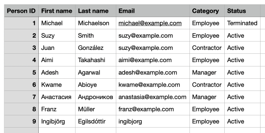
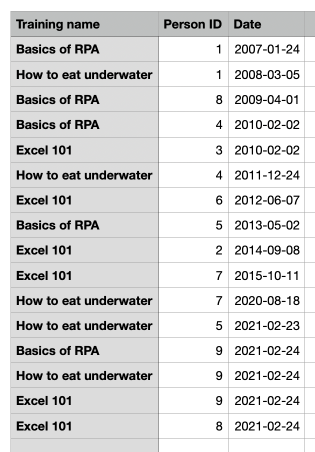

# Employee training reminders robot

## Background story

Acme Corporation requires employees to complete the required training. The employee and training information is stored in a highly-sophisticated HR solution: Excel files!

### `employees.xlsx`

| Person ID | First name | Last name  | Email               | Category | Status     |
| --------- | ---------- | ---------- | ------------------- | -------- | ---------- |
| 1         | Michael    | Michaelson | michael@example.com | Employee | Terminated |
| ...       | ...        | ...        | ...                 | ...      | ...        |

### `trainings.xlsx`

| Training name | Person ID | Date       |
| ------------- | --------- | ---------- |
| Basics of RPA | 1         | 2007-01-24 |
| ...           | ...       | ...        |

### The process

Every time an active employee completes a training, a new row is added to the `trainings.xlsx` file. The `Person ID` is used to refer to the `employees.xlsx`.

Jane from HR sends weekly reminders to employees who have not completed all the training. This is a fully manual process, and to be honest, quite dull.

## The automation

This Python robot automates the training reminder process:

- Reads the employee and training data from the Excel files. No Excel application required!
- Finds the active employees (`Category` = `Employee`, `Status` = `Active`).
- Sends an email reminder to all employees who have not completed all the required training.
